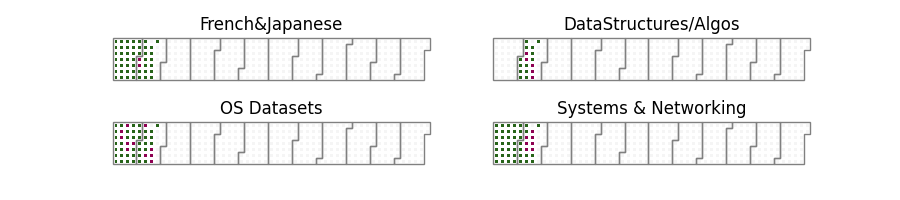

# Data scientist and data engineer

## Currently Working on:

+ Head of Data Science Consulting at Centriam
+ **Building Open Source Datasets:**
    + [Python Data Pipelines](https://github.com/codenym/datapipelines):  The repo where the main data pipelines will live built using dagster and an s3 data lake
    + [ezduckdb python library](https://codenym.github.io/ezduckdb/):  Python library to assist with working with s3 data lake using duckdb.  Includes things like db connection management and querying and sql templating.
    + [GoDuck CLI tool written in Go](https://github.com/Codenym/GoDuck):  CLI useful for working with datalake.  Does things like convert templated sql files to runnable sql and create duckdb databases with data in datalake (either as reference or as table).
+ [Data Structures and Algorithms](https://isaac-flath.github.io/DataStructuresAlgorithms/):  I am working through the neetcode roadmap to enhance coding skills.

## Consistency

Spending a little time close to every day over a long period of time is extremely powerful and underated for personal growth.  I track 3 - 5 things I am working on daily at any given point in time, here's the current ones:

